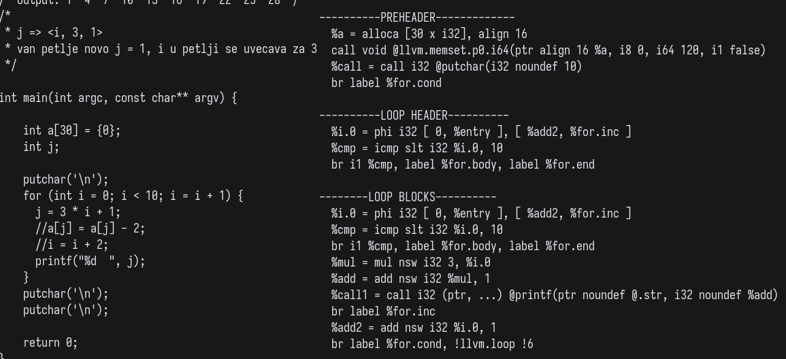
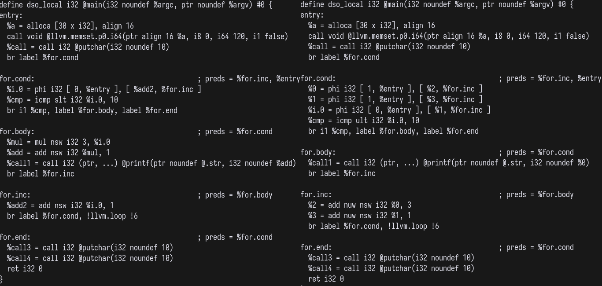

# Strength Reduction Pass Project

**Strength reduction of induction variables**

*Explanation*:

Petlju hocemo da ubrzamo tako sto cemo skupe operacije (mnozenje)
zameniti jefitnijim (sabiranje). U primeru ispod mnogo je bolje izdvojiti
promenljivu `j` iznad petlje kao `j = 2` i da se svaki put u petlji racuna kao
`j = j + 6`.

```
i = 0;                      i = 0;
while (i < 10) {            j = 2;
    j = 3*i + 2;            while (i < 10) {
    a[j] = a[j] - 2;            a[j] = a[j] - 2;
    i = i + 2;                  i = i + 2;
                                j = j + 6;
}                           }
```

U ovom slucaju `j` je *induction variable* jer zavisi od brojaca petlje (`j =
3*i + 2`). Kod kompajlera to je linearna funkcija `f(i) = a*i + b` gde je `a`
multiplikativni faktor, a `b` aditivni. *Kombinacija vise induction promenljivih
je takodje induction promenljiva*. Na primer ako imamo da je `i` induction
promenljiva i `j = a*i + b`, kao i da je `k = c*j + d` tada ce `k` biti takodje
induction promenljiva sa faktorom mnozenja `a*c`, dok ce faktor sabiranja biti
jednak `b + d`.

Induction promenljive mozemo da predstavimo kao trojku `<x, y, z>`, gde je *x -
osnovna indukciona promenljiva*, *y - faktor mnozenja*, *z - faktor sabiranja*.
* Brojac `i` kao `i => <i, 1, 0>`
* Promenljivu `j = a*i + b` kao `j => <i, a, b>`
* Promenljivu `k = c*j + d` kao `k => <i, a*c, b + d>`
* itd.

**Algorithm**:

Kako naci indukcione promenljive?

1. Osnovnu indukcionu promenljivu nalazimo u phi cvoru (dobija se `-mem2reg`
   opt) header-a petlje.
2. Prolazimo kroz sve instrukcije petlje da bi nasli preostale indukcione
   promenljive
  3. Ako nadjemo `k = b * j` gde je `j` induction promenljiva sa trojkom `<i, c, d>`
     onda `k => <i, b*c, d>` cuvamo
  4. Ako nadjemo `k = j + b` gde je indukciona promenljiva sa trojkom `<i, c, d>`,
     onda `k => <i, c, d + b>` cuvamo
5. Zaustavljamo se kada nema vise promenljivih, npr. velicina strukture gde
   smestamo se ne menja.

Kako primeniti strength reduction? **doraditi...**

1. Potrebno je dodati induction promenljive u preheader ili header?? i
   izracunati im pocetnu vrednost
2. Zatim ubacimo nove instrukcije u telo petlje.

Ako je `j` indukciona promenljiva (npr. `j = 3*i + 1`) potrebno je nju staviti
van petlje, na isto mesto kao i brojac petlje (pogledati **Explanation** gore).

> **Brojac se nalazi u header-u petlje i dat je kao phi instrukcija, znaci da i
> nasa promenljiva `j` mora biti phi instrukcija**!

Preciznije, kako mi ne mozemo da nadjemo pocetak header bloka, uopste pocetak
basic block-a (mislim da je pominjao na casu ovo), nego samo
terminator/poslednju instrukciju, moramo sa `getTerminator()` da dohvatimo kraj
preheader bloka i odmah posle njega da ubacimo napravljenu phi instrukciju.
Slika za pomoc:




Znacenje *phi* instrukcije (valjda):

`%1 = phi i32 [1, %entry], [%2, %for.inc]`

* Ako je kontrola toka dosla iz `%entry` bloka, onda ce promenljiva `%1` imati
  vrednost `1` (const).
* Ako je kontrola toka dosla iz `%for.inc` bloka, promenljiva `%1` ce imati
  vrednost promenljive `%2`.

Na mesto gde ubacujemo *nadjenu* indukcionu promenljivu ne ubacujemo osnovnu ind
prom, odnosno brojac zato je `if (get<0>(t) == PN && (get<1>(t) != 1 ||
get<2>(t) != 0))`.

Posto nemamo funkciju koja vraca samo telo petlje bez header-a, mora manuelno da
se te instrukcije cuvaju negde prolazeci kroz celu petlju (header i telo su
spojeni, vidi sliku gore).

Pogledati funkcije `getIncomingValue()` i `getIncomingBlock()` koje su vezane za
*phi* blok!

Problemi:
* Sta ako ima vise petlji, samim tim ima vise osnovnih indukcionih
  promenljivih?
* Sta ako ima vise indukcionih promenljivih u jednoj petlji?
* Kako izbeci da mapa ne cuva dve vrednosti za `j => (i, 3, 2)`, to su `j => (i,
  3, 0)` i `j => (i, 3, 2)`?
* ~~Jel menjamo phi node novim ili ne?~~
* ~~Gde tacno treba staviti: preheader ili header petlje?~~

**Radimo samo sa jednom indukcionom promenljivom za sada, posle cemo uopstiti!**



> Kako bi trebalo da izgleda.

**Tasks**:

- [ ] Obrasati spoljnu petlju `while (changed) {` i poredjenje na dnu.
- [ ] Postaviti pronadjenju indukcionu promenljivu na svoje mesto.
- [ ] Induk prom dodeliti dobre vrednosti (za blok iz koga se dolazi, kao i
  vrednot) unutar phi instrukcije
- [ ] Proci kroz blok petlje i zameniti instrukcije
- [ ] Obrisati instukcije u bloku petlje koje se ne koriste
- [ ] ...

**Compilation and invocation:**

```
clang -S -fno-discard-value-names -emit-llvm -O0 -Xclang -disable-O0-optnone
opt   -S -load lib/LLVMStrengthReductionPass.so -mem2reg -matf-sr -enable-new-pm=0 <input>
```

## Literatura
* [LLVM Loop Terminology (and Canonical
  Forms)](https://releases.llvm.org/11.0.0/docs/LoopTerminology.html)
* [Loop Optimizations and Pointer Analysis, University of Texas
  ](https://www.cs.utexas.edu/~pingali/CS380C/2019/lectures/strengthReduction.pdf)

## Test Script

`test.sh` compiles and runs C/C++ the programs in `TestPrograms` direcctory. Use the `-k` flag to keep the .ll files.

Programs are timed before and after the optimization pass, and outputs are compared to determine whether the opt is at least somewhat correct.

---

By:
* Matija Lojović - 45/2018
* Radovan Bozić - 172/2018
* Luka Colić - 31/2018
